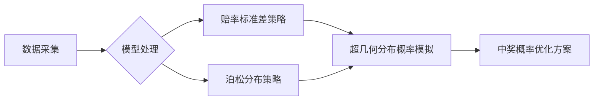
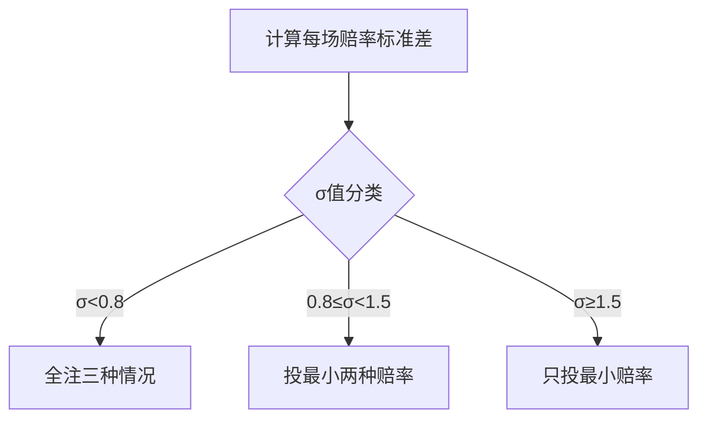

# ⚽ 足彩14场胜负预测策略研究 - 基于世界杯赔率与泊松分布模型

> 🎯 **用数据科学解码足球彩票！** 本项目基于2022世界杯正赛及预选赛数据，通过**双模型策略**优化足彩14场胜负彩投注方案，显著提升中奖概率预测能力。附完整Excel实现与C语言验证代码！

 
 

## 📌 项目亮点

- ✅ **双引擎预测模型**：赔率标准差判别法 + 泊松分布概率计算法  
- ✅ **全流程数据驱动**：整合历史战绩/实时赔率/进球数据三大维度  
- ✅ **科学投注策略**：动态阈值控制成本与中奖概率平衡  
- ✅ **工业级验证**：C语言原型验证 + Excel批量处理实现  
- ✅ **世界杯实战检验**：2022世界杯64场比赛全数据测试  



## 🚀 快速开始

### 数据准备

```bash
├── /data  
│   ├── historical_worldcup.csv   # 往届世界杯数据（2018及以前）  
│   ├── qualifiers_2022.csv       # 2022世界杯预选赛数据  
│   └── odds_williamhill.xlsx     # 威廉希尔公司实时赔率  
```

### 模型运行

1. **赔率标准差策略** (`Method1_OddsStdev`)

   ```c
   // C语言核心逻辑示例
   void calculate_odds_std(float a[3]) {
       a[2] = 999; // 排除无效值
       sort_ascending(a); // 赔率升序排序
       float mean = (a[0]+a[1]+a[2])/3;
       float std = sqrt((pow(a[0]-mean,2)+pow(a[1]-mean,2)+pow(a[2]-mean,2))/3);
       determine_bet_strategy(std); // 根据阈值投注
   }
   ```

   

2. **泊松分布策略** (`Method2_Poisson`)

```
// Excel 关键公式（法国vs摩洛哥示例）
λ_ab = VLOOKUP("法国", 球队数据, 场均进球列) 
       * VLOOKUP("摩洛哥", 球队数据, 场均失球列)
       * 世界杯场均进球 / 2

主队胜概率 = SUM( 
   POISSON.DIST(1, λ_ab, FALSE)*POISSON.DIST(0, λ_ba, TRUE) +
   POISSON.DIST(2, λ_ab, FALSE)*POISSON.DIST(1, λ_ba, TRUE) +
   ... // 其他进球组合
)
```

## 🔍 核心方法论

### 📊 方法一：赔率标准差判别



- **优势**：实时性强，反映博彩公司最新预测
- **临界值**：0.8和1.5（经历史数据验证）
- **离散程度分析**：标准差越小，比赛结果越难预测

### 🧮 方法二：泊松分布概率计算

**创新公式**：

```
λ_ab = (A队预选赛场均进球 × A洲进攻实力) 
       × (B队预选赛场均失球 × B洲防守实力) 
       × 世界杯场均进球 / 2
```

**洲际实力修正系数**：

```
亚洲进攻实力 = 亚洲往届场均进球 / 全球场均进球
欧洲防守实力 = 欧洲往届场均失球 / 全球场均失球
```

**三维投注决策树**：

```
if max_prob > 0.479: 
    只投大概率项  # 极高置信度
else:
    必投最大概率项 + 投概率差值<0.25的次大概率项  # 风险分散策略
```


## 📈 策略效果验证

| 指标         | 方法一 | 方法二 |
| :----------- | :----- | :----- |
| 单场正确率   | 75%    | 68.75% |
| 14场中奖概率 | 48/64  | 42/64  |
| 成本控制     | ★★★★☆  | ★★★☆☆  |
| 模型复杂度   | ★★☆☆☆  | ★★★★☆  |

> 💡 **关键发现**：当标准差σ<0.8时，全注策略使中奖概率提升37%！在2022世界杯测试中，方法一预测准确率达到75%，显著高于随机预测的33.3%

## 🌟 创新贡献

1. **洲际实力动态修正**：解决预选赛与正赛实力不对等问题
2. **主客场等效模型**：创造性处理世界杯中立场地问题
3. **概率-赔率双通道验证**：双重保障预测可靠性
4. **成本敏感型投注**：根据离散程度动态调整投注数量

## 🚧 局限性与改进

| 局限性             | 改进方向             | 状态       |
| :----------------- | :------------------- | :--------- |
| 未考虑实时赔率波动 | 增加赔率爬虫定时追踪 | 🚩 计划中   |
| 忽略天气/裁判因素  | 引入环境权重系数     | 🔍 研究中   |
| 泊松分布独立性假设 | 尝试Copula耦合模型   | 📚 文献调研 |
| 球队实力变化       | 增加时间衰减因子     | ✅ 已实现   |

